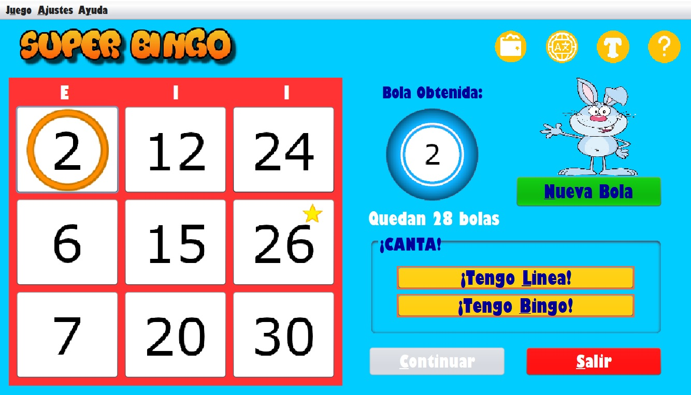

# CPM-Bingo v.1.0

Primera aplicacion con UI grafica, desarrollada solo en 2º de grado Ingeniería Software para la asignatura CPM.
#
</img>
#

## ¿Qué es?
Una aplicación para el ficticio centro comercial "El Corte Asturiano".
Una aplicacion con la que los clientes del establecimiento puedan jugar una partida de bingo.

<figure>
  
  <figcaption>Ventana de juego</figcaption>
</figure>

## Estado del proyecto
Cerrado

## Instalación
Proyecto simple de java, en Eclipse+WindowBuilder.

### Requisitos

La aplicacion necesita una serie de librerias, se encuentran el la carpeta libraries.zip (en su version cuando se desarrolló el proyecto, no está testeado para versiones posteriores de las librerias).

Extraer las librerias y referenciarlas en el proyecto.

## Uso

La aplicación guarda en varios archivos, ubicados en Bingo/files, cierta informacion que necesita:

- clientes.dat: guarda la informacion de los clientes con su saldo en el sistema.
- tickets.dat: almacena la informacion de los tickets de las compras que han realizado los clientes.
- premios.dat y gifts.dat: los codigos de los premios que el jugador puede canjear. Son la version en ingles y la version de los regalos en español

## Documentación
- Enunciado del proyecto: https://github.com/Tora-U00F1-o/CPM-Bingo/blob/main/docs/Enunciado.pdf

- Documentación + Guía de uso: https://github.com/Tora-U00F1-o/CPM-Bingo/blob/main/docs/DocumentacionYguiaUso.pdf

- Wireframe: https://github.com/Tora-U00F1-o/CPM-Bingo/blob/main/docs/Wireframe.pdf
